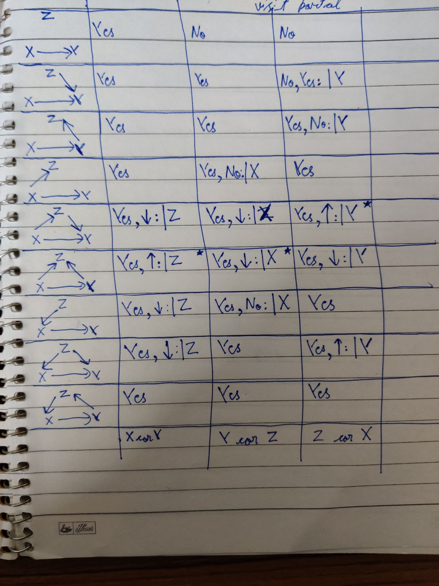

```{r setup, include=FALSE}
knitr::opts_chunk$set(echo = TRUE)
```

## Causal Model: **z -> x -> y**
These are the options possible:


#### Synthesizing data
```{r}
sample_size = 1000
z = sample(1:10, prob = c(.05, .15, .3, .01, .03, .06, .12, .08, .1, .1), size = sample_size, replace = TRUE)

# x = rnorm(sample_size, mean = z, sd = .3 * z)
# prob_y = ifelse(x>10, 1, x/10)
# y = rbinom(sample_size, 10, prob = prob_y)

x = z + sample(1:5, prob = c(.2, .4, .2, .15, .05), size = sample_size, replace = TRUE) 

y = x + rbinom(sample_size, 10, prob = .7)
```
  
#### Checking correlation before conditioning
```{r}
cor(z, x)
cor(x, y)
cor(z, y)
```

#### Need to check if correlation between x and y decreases after conditioning on z
Conditioning on z
```{r}
synth_data <- data.frame(x = x, y = y, z =z)

corr_conditioned_on_z <- synth_data %>% 
  group_by(z) %>% 
  summarise(count = n(),
            corr_x_y = cor(x, y)) %>% 
  mutate(proportion = round(count/sum(count), 2)) %>% 
  arrange(desc(count))

kable(corr_conditioned_on_z)
```


Weighted correlation is:
```{r}
sum(corr_conditioned_on_z$corr_x_y  * corr_conditioned_on_z$proportion)
```

So, the ans. is **Yes**, correlation between x and y decreases after conditioning on z for model z -> x -> y


#### Need to check if correlation between z and y goes away after conditioning on x
Conditioning on x
```{r}
corr_conditioned_on_x <- synth_data %>% 
  group_by(x) %>% 
  summarise(count = n(),
            corr_z_y = cor(z, y)) %>% 
  mutate(proportion = round(count/sum(count), 2)) %>% 
  arrange(desc(count))

kable(corr_conditioned_on_x)
```

Weighted correlation is:
```{r}
sum(corr_conditioned_on_x$corr_z_y  * corr_conditioned_on_x$proportion, na.rm = TRUE)
```

So, the ans. is **Yes**, correlation between z and y goes away after conditioning on x for model z -> x -> y

## Causal Model: z -> x -> y <- z  

#### Synthesizing data
```{r}
sample_size = 1000
z = sample(1:10, prob = c(.05, .15, .3, .01, .03, .06, .12, .08, .1, .1), size = sample_size, replace = TRUE)

# x = rnorm(sample_size, mean = z, sd = .3 * z)
# prob_y = ifelse(x>10, 1, x/10)
# y = rbinom(sample_size, 10, prob = prob_y)

x = z + sample(1:5, prob = c(.2, .4, .2, .15, .05), size = sample_size, replace = TRUE) 

y = x + z + rbinom(sample_size, 10, prob = .7)
```

#### Checking correlation before conditioning
```{r}
cor(z, x)
cor(x, y)
cor(z, y)
```

#### Need to check if correlation between z and y stays after conditioning on x
Conditioning on x
```{r}
synth_data <- data.frame(x = x, y = y, z =z)

corr_conditioned_on_x <- synth_data %>% 
  group_by(x) %>% 
  summarise(count = n(),
            corr_z_y = cor(z, y)) %>% 
  mutate(proportion = round(count/sum(count), 2)) %>% 
  arrange(desc(count))

kable(corr_conditioned_on_x)
```

Weighted correlation is:
```{r}
sum(corr_conditioned_on_x$corr_z_y  * corr_conditioned_on_x$proportion, na.rm = TRUE)
```

So, the ans. is **Yes**, correlation between z and y stays after conditioning on x for model z -> x -> y <- z